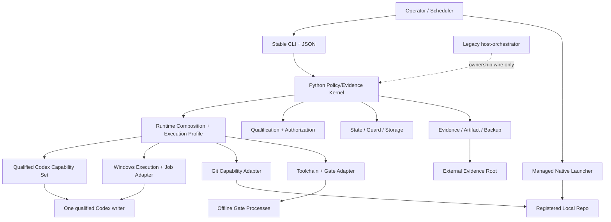
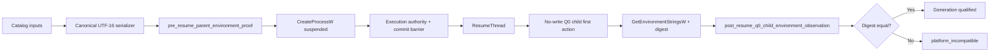

# Local AI Runtime 0.2 目标架构

## 1. 状态与架构原则

目标规范为 `local-ai-runtime-0.2-v3.25`，当前仍是 baseline candidate。本文描述批准后的目标，不宣称组件已经实现；v3.24 candidate/package/plan 是保留 exact bytes/hash 的 superseded inputs。

核心原则：

- 自由判断留在 Human-controlled Native；无人值守 Batch 只执行已批准、封闭、可复算的任务。
- Python Policy/Evidence Kernel 是可信控制面，Codex writer 是不可信、zero-or-one execution-commit 的受限计算进程。
- Epoch 1 是 Windows 本机、单操作者、单 SQLite authority、全局 capacity=1；controller side effects 用 authority、fence、CAS、immutable intent/result、read-back 和 reconcile 收口。
- 产品以低人工、可预测、可恢复的开发吞吐为目标：Native 快路径优化低交互延迟；Batch 的 capacity=1 是可靠性边界，不能宣传为高速并发吞吐。
- Git commit/ref 是唯一交付，evidence 外置；不 merge/push。
- 当前 `runtime/host-orchestrator` 与目标 `runtime/local-ai-runtime` 之间只共享 ownership wire contract，不共享数据库或实现模块。
- 不以“最终一致”掩盖不可解释的进程、对象、ref、worktree 或 evidence 状态。
- 长期产品范围是受控本地开发工作流，不预建跨平台、多租户、分布式或第二 agent runtime 空壳；未实现 protocol 的能力始终 unsupported。

repo planning 是实现期薄控制面，不是目标 runtime 的第二套编排架构。唯一 `planning_optimization_policy` 在现有 machine work items 中定义 work-item 原子 closeout、bounded continuation、复杂度硬上限、planning model 候选资格化和结果指标；selector、planning-status 与 verifier 继续复用。不得新增第二个 planner/router、平行 task 真源或 runtime model-router service。该 planning policy 不进入冻结 v3.25 runtime authority，也不改变 capacity=1、effect protocol、Q0 或事实来源。

## 2. 当前态与目标态

| 维度 | 当前态 | 目标态 |
|---|---|---|
| 运行内核 | `runtime/host-orchestrator` | `runtime/local-ai-runtime/src/local_ai_runtime/` |
| 状态 | `.ai/state/control-plane.db`，另有 experimental runtime_v2 | `%LOCALAPPDATA%/LocalAIRuntime/state` 独立 DB |
| 运行证据 | legacy `.ai/runs/...` | 外置 `evidence`、journal、receipt、artifact index |
| 所有权 | 尚无 v3.25 shared guard | versioned ownership wire + repo mutex + generation |
| 执行 | legacy host-local paths | isolated Job-bound writer/gate/Git adapters |
| 迁移 | 未开始 | guard legacy -> implement isolated -> per-repo cutover -> read-only compat |

批准前禁止创建目标包；P0C Legacy Ownership Guard 绿色前禁止目标 runtime claim repo。

v3.25 是 v3.24 的最小 successor：`CREATE_SUSPENDED` child 在 `ResumeThread` 前不运行，无法在该时点调用 `GetEnvironmentStringsW` 自读并报告 environment；predecessor 的 exact-option sync spelling 也不是受支持参数。产品、架构、容量、exact toolchain 和 launch experience 保持不变。0.2 只接纳 CLI execution interface；App Server、SDK、managed Worktree 和 Automations 都 deferred，未来必须各自通过 capability generation、Implementation Acceptance 与 Full Q0。

目标源码的首级子包边界固定为 `contracts/kernel/qualification/storage/execution/recovery/git_local/operations/compat`。结构化机器约束固定为 `approved_root_files=["__init__.py","__main__.py"]`、`approved_subpackages=["contracts","kernel","qualification","storage","execution","recovery","git_local","operations","compat"]` 和 bootstrap/marker 到首个任务的一对一 `required_source_owners`。`__main__.py` 仅作为 `python -m local_ai_runtime contracts verify` 的薄转发层。Artifact/evidence 持久化归 `storage`，安装、激活、CLI、Batch、doctor、scheduler、managed Native 和 evaluation 编排归 `operations`；不得在包根新增其他功能模块，也不得增生平行的 `evidence`、`commands` 或其他未批准首级子包。

## 3. 逻辑架构



稳定 kernel 负责 task/attempt/generation、lease/fence/CAS、qualification/Authorization、recovery、evidence、backup/migration/rollback 和 activation authority。可演进层只实现由同一 `RuntimeCompositionManifest` 绑定并共同验收的 Codex/Windows/Git/toolchain capability 与 `ExecutionProfile`。Profile 只能选择已实现能力，不能把 Provider、network、delivery、Git format 或 concurrency protocol变成配置开关。

首发 CLI 不是另一套业务逻辑，而是 `operations` 对同一 typed application services 的 human/JSON 双投影：`doctor` 读取 qualification/toolchain probes；`repo qualify` 写 versioned observation；`template list/show` 只读 `LaunchTemplateCatalog`；`batch dry-run` 生成无副作用 `WorkDefinition + EffectPlan + GateGraph preview`；`submit` 在 anti-replay challenge 后写 durable task；`status/action/evidence` 读取 public projection。`OperatorPresentationCatalog` 只把 reason code/public fields 映射为文本、exit code 和 next command，禁止拼接 raw output。

四个 launch templates 都是 versioned closed data，不包含可执行 selector code：`docs_contract_sync_v1`、`bounded_lint_type_repair_v1`、`focused_test_repair_v1`、`mechanical_repo_maintenance_v1`。每项都绑定 parameter schema、path/effect envelope、gates、limits、stop/recovery 和 evaluation denominator。Native Spec 仅能创建 candidate；promotion 走独立 operator action、new generation、fixtures、pilot/canary 与 repo requalification。

`CodexPlatformCapabilitySet` 可由正交 surface 演进：CLI/SDK 的 `ExecutionInterfaceCapability`、App Server 的 `ClientProtocolCapability`、managed Worktree 的 `WorkspaceIsolationCapability`、Automations 的 `SchedulingCapability`。0.2 只实现 CLI；其余不是 dormant flags。未来每个 surface 与组合都必须独立绑定 version/help/schema/tool inventory、sandbox/permission probe、state/effect envelope、recovery/rollback 与 evidence projection；一个 surface 的资格化不向其他 surface 继承。

`RuntimeToolchainManifest` 是 supply-chain identity 根：绑定 Python 3.11.x patch/absolute path/file identity/hash、uv identity、lockfile、distributions/plugins、build frontend/backend 与 hashed build constraints。`VerificationExecutionProfile=new_runtime_exact_v1` 把显式 exact sync 与验证分开，固定 `supply_chain_identity -> build -> test -> contract_invariant -> hotspot`，并用 clean-root repeatability 拒绝缓存偶然性。

### 3.1 模块化单体

目标包边界固定为：

- `contracts`：approved schema、catalog、canonical envelope、typed object。
- `kernel`：state/guard、policy evaluation、reason codes、capacity。
- `qualification`：repo/template/toolchain/environment/model/profile/Q0。
- `storage`：SQLite、migrations、CAS、leases、outbox、backup metadata。
- `execution`：process env、named object、Job、marker、pipe、journal、gate。
- `recovery`：takeover、adoption、continuation、reconcile、cleanup。
- `git_local`：Git audit、index/object/commit/ref/finalize/remove。
- `operations`：install/activation、CLI、Batch/doctor、scheduler、managed Native、OperatorAction 和 evaluation 的应用编排；通过批准接口调用其他包，不下沉重复机制。
- `compat`：ownership wire 和最终只读 legacy projection。

新包不得 import、调用或双写 `host_orchestrator`。共享行为必须通过批准的 wire schema 和 cross-conformance fixture 实现。

## 4. 信任和权限边界

可信：hash-pinned controller、当前 SID、OS keyring、宿主 OS 与批准的 immutable artifacts。

不可信或需验证：repo 内容、project config、AGENTS/skills、Codex output、working tree、Git config、environment drift、named object、reparse/hardlink、external Native edits。平台机械限制这些输入可造成的副作用，但不声称消除 prompt injection、语义误导或错误 patch。

明确不防御：已攻陷的同 SID controller、内核、pagefile、物理主机。安全结论只能说“已声明与已检测敏感信息零泄漏”。

Writer profile 固定 `approval_policy=never`、no history、no login shell、empty inherited env、keyring-only、task-side network denied，并无条件生成 `projects.<canonical-worktree>.trust_level=untrusted`。该配置不替代 AGENTS、skills、attributes、hooks 和 repo content 审计。

## 5. 运行根与隔离

生产根为 `%LOCALAPPDATA%/LocalAIRuntime`：

```text
versions/                 immutable installed versions
policies/ schemas/        content-addressed read-only policy
codex-home/config/        immutable shared Codex config
codex-home/.sandbox/      managed mutable sandbox state
codex-home/.sandbox-secrets/ broker-only secret state
state/ ownership/         controller-managed mutable state
evidence/ backups/        durable controller evidence
quarantine/               ACL-restricted sealed material
reserve/                  allocated controller-only emergency reserve
environments/<hash>/      immutable qualified dependencies
runs/<attempt>/
  profile/ xdg-config/ codex-sqlite/
  tmp/ cache/ spool/ worktree/ empty/
```

每 attempt 独占所有可写 HOME、USERPROFILE、APPDATA、LOCALAPPDATA、XDG_CONFIG_HOME、CODEX_SQLITE_HOME、TEMP/TMP、cache 和 spool。Codex sandbox 自身的受管可写状态由 `CodexSandboxStateBinding.v1` 绑定 setup generation、ACL、owner、identity 和日志轮换；`.sandbox-secrets` 仅 broker/helper 可读，永不进入 manifest/evidence/backup/hash。`sandbox.log` 是 opaque diagnostic，不解析字段、不持久化正文/hash；交互导出必须先创建 OperatorWorkSession 并通过 secret scan。每次 spawn 前后复核 writable roots 及祖先的 final path、volume/file identity、owner/DACL、reparse 和 hardlink count。

只支持经 crash probe 证明的本地固定 NTFS；不要求全局关闭 8.3。Qualification 枚举可观测 long/short aliases，并以 no-follow handle、volume identity、FILE_ID_128、root ancestry、owner/DACL、reparse/hardlink 和 alias-bypass probe 作最终判定。卷策略不可查询时记录 `policy_query_denied` 并由非提权行为 probe 补足；只有身份冲突、alias 绕过或无法建立安全证明才 incompatible。不宣称通用 Windows parent-directory fsync。

## 6. 数据与身份

### 6.1 Canonical object

所有可复算对象使用 domain-separated canonical JSON envelope。Parser 拒绝重复 key、float、non-NFC string 和 schema 越界。数组默认保序；只有 schema 声明 `set_semantics` 时按唯一 key 排序，重复 key 拒绝。

Git path 保留原始 UTF-8 拼写，只验证不改写。Windows collision key 单独计算，不能替代 Git path。

### 6.2 主要数据聚合

- Baseline/architecture epoch/capability/profile/composition/activation/toolchain/environment generations。
- WorkDefinition、TaskFamily、RepoProfile、EffectPlan、GateGraph、EvaluationProfile 与 CapabilitySnapshot。
- Repo/template qualification 与 `QualificationSensitiveInputSet`。
- SubmissionFamily、BatchTask、Attempt、Authorization、Continuation、AuthorizationExecutionGrant、SafetyOnlyExecutionRecord。
- JobIdentity、WriterLaunchRecord、StageLaunchRecord、writer marker、WriteAccountingSnapshot、EmergencyDiskReserveRecord、optional HardWriteQuotaReservation、journal segment、event chain、receipt。
- FencedAction Intent/Adoption/Head/Result。
- ObjectSetManifest、artifact/outbox、evidence/closeout、backup。
- Platform/repo/template/autonomy/operator state policy。

SQLite 是唯一 policy/transition authority，使用 `journal_mode=DELETE`、`foreign_keys=ON`、`synchronous=FULL`、短 `BEGIN IMMEDIATE` 事务。Journal segment 是 append-only observation/audit/recovery input：每段绑定 accepted DB cursor、attempt/fence/action identity 和 immutable event hash；replay 只能提出 recovery candidate，必须经当前 guard + CAS 写回 SQLite 后才成为状态。相同 accepted history 与 policy generation 必须得到相同 recovery decision，不依赖 wall clock 或 restart count；journal 缺口、重复、越 cursor 或 fence drift 一律 suspended/recovery-first。

## 7. 状态域

状态不做单一笛卡尔积，而按独立 policy 拆分：

- `SubmissionFamilyStatePolicy`
- `BatchTaskStatePolicy`
- `AttemptStatePolicy`
- `PlatformOperationalStatePolicy`
- `RepoCutoverMaintenancePolicy`
- `TemplateLifecyclePolicy`
- `AutonomyPolicy`
- `OperatorActionCatalog`

跨域条件只通过 versioned `GuardCatalog`。每个 transition row 必须含 source、operation/event、guards、allowed effects、target、exit code、capacity disposition、scheduler priority 和 retry policy。未知组合 exit 2。

Guard precedence：baseline approval -> implementation acceptance -> P2 Q0 -> platform incompatible -> manual drain/suspend -> needs_auth -> platform unavailable/qualification -> disk_pressure -> repo ownership/maintenance -> template/Authorization -> task/base/environment -> recovery -> capacity。

## 8. Writer launch 与恢复

合法链：

```text
launch_intent
  -> durable_marker
  -> spawned_suspended
     -> terminated_before_execution_commit
     -> writer_execution_committed
        -> resume_observed | resume_outcome_unknown
        -> process_exited
```

Spawn 使用 `CREATE_SUSPENDED + PROC_THREAD_ATTRIBUTE_JOB_LIST` 原子加入预建 Job。PID/creation time 持久化后才是 `spawned_suspended`；writer 使用 `WriterLaunchRecord`，gate/Git/probe/recovery helper 使用 `StageLaunchRecord`，两者都在 resume 前绑定恰好一个 execution authority 和对应 execution-commit barrier。Writer/正常 gate 使用 active-Authorization grant；可收养 controller action 的 Git/helper child process 使用绑定 parent action grant、current fenced head 与 exact StageJob 的 inherited grant；封闭 safety helper 使用 `SafetyOnlyExecutionRecord`。Revoke 与 root grant 由同一 repo-lock/`BEGIN IMMEDIATE` 顺序线性化。

Windows environment 采用两阶段、不同证据资格的证明流：



`pre_resume_parent_environment_proof` 每次 launch 都验证传入的 canonical block、key grammar、OrdinalIgnoreCase uniqueness、排序、长度、double-NUL、digest 与 CreateProcess flags；它证明 parent 输入，不声称读取 child。`post_resume_q0_child_environment_observation` 只由专用 no-write Q0 child 在 resume 后第一个 application action 产生，用于资格化同 generation 的 serializer/CreateProcess composition。普通 writer/gate 仍生成独立 parent proof，但不逐 child 执行或展示 Q0 probe；任何 mismatch、未知 generation 或证据混用都 fail closed。

`writer_effect_id=stable(task_generation,resolved_writer_intent)`；`writer_launch_id=unique(writer_effect_id,attempt_id)`。同一 task generation 的 writer execution commit 为 0 或 1；同一 attempt 最多一个 launch/process identity。只有 suspended process 在 execution commit 前被证明终止时，fresh attempt 才能复用 effect ID 并创建新 launch ID。一旦 committed，该 task generation 永久禁止再启动 writer，零 tool/零 mutation 或 `resume_outcome_unknown` 都不能证明未执行；原进程仍须被 exact PID/Job 跟踪、drain、终止和 seal，无法闭合时写稳定 unresolved result，不发布 commit/ref。合法语义重做只能由原子 resubmission 创建新 task generation。

同名 Job 即使零进程也不能复用。检查、关闭检查 handle、重新 CreateJobObject 全程持 attempt mutex；`ERROR_ALREADY_EXISTS` 继续 park，不能换名绕过。

## 9. Fenced side effects

四表分离：immutable `FencedActionIntent`、append-only `FencedActionAdoption`、mutable CAS `FencedActionHead`、immutable terminal `FencedActionResult`。

第一次 adoption 的 prior head 是 intent hash；后续指向 prior adoption hash。插入 adoption 与更新 head 在同一事务，`UNIQUE(action_id, prior_head_hash)` 防分叉。Writer 永不可 adoption。

可 adoption 的 controller action 仅限具有 immutable logical-effect grant、确定 postcondition verifier 和稳定 read-back 的 worktree、object、artifact、finalize、task-ref、remove 与绑定完整 JobIdentity 的 terminate_job。正常 action 的 adoption 继承同一 root Authorization grant；`terminate_job` 继承同一 safety-only authority，不得因 Authorization 已撤销而失去终止能力。Process record 本身不可 adoption；只有证明前一 child process 已终止且 postcondition 不确定性已消除后，才能启动下一确定 child step。Writer 不因缺少可重试 postcondition 而被排除出 Batch，但 committed 后绝不重跑。

## 10. Git publication

所有 Git 调用使用绝对 executable/argv、清空继承 `GIT_*`、固定 config allowlist，并在 sandbox/Job/overlay 内运行。第一次调用先 no-follow 解析 `.git`/common-dir，再执行受管 `rev-parse`。

```mermaid
flowchart LR
    A["Original repo audit"] --> B["Worktree + writer"]
    B --> C["Secret scan + offline gates"]
    C --> D["Attempt-local blobs/trees/commit"]
    D --> E["Seal ObjectSetManifest"]
    E --> F["Promote objects"]
    F --> G["Common-store reachability"]
    G --> H["Finalize index"]
    H --> I["Finalize detached HEAD"]
    I --> J["Create task ref"]
    J --> K["External evidence"]
    K --> L["Remove worktree"]
```



`git_hybrid_materialization_v1` 中，controller 先独立生成 canonical blob/tree/commit payload、reachability graph 和 expected OID；pinned Git `hash-object -w` 只向 attempt-local object directory materialize，再用 `cat-file` read-back type/size/payload。Existing objects 通过 canonical type+size+payload/OID 验证，不能比较 loose zlib bytes，也不能把 Git plumbing 当作唯一 oracle。Claim CAS 只生成一次 UTC 秒并绑定 attempt/Git manifest；commit 固定唯一 parent、header order、identity 和 message grammar。Worktree `logs/HEAD` 必须由 create action收口，HEAD/task-ref使用 `--no-create-reflog` 并前后证明log不存在。Finalize 不使用 `reset --hard`。

## 11. Native、Batch 与 ownership

正常 Native maintenance 不杀当前 attempt：先 durable drain，等自然 terminal，再取得 global capacity 和 repo mutex。Qualification 失败只暂停目标 repo/template，其他 repo 可恢复调度。

Ownership record 绑定 canonical common-dir identity、owner、status、generation、registry generation 和 checksum；首次 no-replace，更新 expected generation/checksum + atomic replace。Legacy/new 使用相同 SID/repo identity canonicalization 和 named mutex SDDL。

迁移期间：

1. 所有 repo 初始 legacy-owned。
2. Legacy 每个副作用入口先消费 ownership guard。
3. 新 runtime 未通过 cross-conformance 前禁止 claim。
4. 每 repo 在零 active、rollback drill 绿色时 CAS cutover。
5. 全部 cutover 后 legacy DB 只读；30 天零调用后移除 legacy writer。

## 12. 资源核账与磁盘保护

0.2 的 mandatory 模式是 `accounting_kill_audit`，不是虚构的目录级内核 quota：

1. Claim 和每次 spawn 前固定 writable-root identity，记录 logical/allocated bytes、entry count、free floor、reserve generation 和 high-water marks。
2. Task roots 使用 `ReadDirectoryChangesW` 触发重算，并由不超过 500 ms 的 monotonic fallback 兜底；watcher overflow、scan gap、identity drift 和 arithmetic overflow 都按 limit+1 处理。
3. Limit+1 的顺序固定为 durable intent -> terminate Job -> drain EOF -> seal -> full no-follow audit；未知或越界结果不得进入 object/ref/evidence/cleanup。
4. Runtime volume 维持 task 不可访问、实际分配的 1 GiB emergency reserve。仅 safety recovery 可释放；释放后必须保持 platform suspended，直到 maintenance 重建并 CAS generation。
5. `HardWriteQuotaCapability` 仅在独立 Full Q0 证明真实 per-root/per-sandbox-user primitive 后启用。未启用时 receipt 明确记录 accounting mode，并承认终止前可能瞬时 overrun。

## 13. Qualification、门与演进

- Baseline Approval 只批准规范 artifact。
- `RuntimeCompositionManifest C` 绑定 architecture epoch、approved baseline、capability set、ExecutionProfile、staged installation 和 implementation/toolchain/adapter/schema/probe hashes；Implementation Acceptance 产生只绑定 C 的 `I(C)`。
- Full Q0 在 `current.json` 仍指向旧版本时测试 staged installation，产生 `Q(C,I,staged_identity)`；它不绑定尚不存在的 activation bundle/record。
- `RuntimeActivationBundle B(C,I,Q,expected_previous_active)` 是唯一完整组合。Activation 持专用 named mutex，先 durable intent，再锁内重读 expected head、atomic replace/read-back `current.json` 并立即 quick preflight；结果写 immutable A。
- `SelectedRuntimeIdentity={bundle_hash,resulting_generation,current_pointer_checksum}` 只表示指针已选择；只有 terminal A 为 `activated_and_preflight_passed` 时，`ActiveRuntimeIdentity={selected_identity,activation_record_hash}` 才存在并可授权 production qualification、Authorization 和 attempt。`selected_not_admitted` 或未终结 intent 必须 suspended/recovery-first。
- Quick preflight 每 attempt；daily canary 持续验证行为。
- `Q0TriggerPolicy` 对 composition diff 分类：已证明 envelope 内的收窄 timeout/resource/path/gate 可走 scoped requalification + new Authorization + canary；新或改变的 CLI/SDK execution interface、App Server client protocol、managed Worktree isolation、Automations scheduling、adapter/provider/runtime engine、sandbox/token/permission/tool inventory、Git/network/delivery、Windows helper、canonicalization/persistence/schema/migration/probe或 unknown diff 必须创建新 capability generation、Implementation Acceptance + Full Q0。

演进层级固定为：profile generation 选择已证明能力；capability generation 引入新 effect protocol；architecture epoch 改变 concurrency/trust/authority topology。Epoch 1 全局 capacity 永久为 1；跨 repo 多 writer需要 successor epoch 的 migration、resource/auth/backup/maintenance/recovery protocol 和完整 crash/conformance matrix。同 repo并发、多操作者或多信任域属于更晚独立 epoch。

0.2 的 autonomy ceiling 是 B2/per-repo scheduling。B3 portfolio selection、portfolio generation 与 repo auto-selection 全部 deferred beyond 0.2，机器图不含激活任务或状态转换；P4 只验证两个显式资格化 repo 的固定 cohort，绿色后直接进入 P5 per-repo cutover。若未来需要 B3，必须用 successor baseline 定义 backlog authority、fairness、cross-repo recovery/resource policy、operator override、data migration 与独立 cohort，而不是在当前 control plane 内开启隐藏开关。

Baseline Approval 的前置是 v3.25 的 15-artifact closure、standalone verifier 和两阶段 review，不是 surface 名称或 predecessor evaluation。若产品/工具链/authority/并发/Q0/事实源或环境证明协议发生语义变化，冻结 v3.25 并创建 v3.26 successor。

当前架构执行入口由 [machine work items](D:/CODE/local-ai-dev-orchestrator/docs/plans/local-ai-runtime-0.2-work-items.json) 控制；不能从本图直接跳到代码实现。
