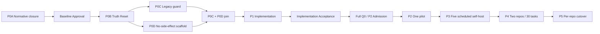

# Local AI Runtime 0.2 路线图

## 1. 路线真值与总原则

当前 baseline candidate 是 `local-ai-runtime-0.2-v3.24`；package 为 `8/15 present, 7 non-present`；唯一 selectable work item 是 `LAR-P0A-009`。机器图总计 55 项，schema 为 `local_ai_runtime_work_items.v4`，含 11 个 closed contract projections，以 [work items](D:/CODE/local-ai-dev-orchestrator/docs/plans/local-ai-runtime-0.2-work-items.json) 为任务真源。

产品目标是 Windows-local single-operator 的 Unified Native + global capacity=1 deterministic commit-only Batch。首发以首次安全 commit-ready 体验和 operator minutes 为中心，不追求并发吞吐。`same_run_reselect_after_verified_atomic_closeout` 允许一次 kickoff 在每项完整 closeout 后继续，默认最多 3 项/180 分钟；不跨阶段、批准、successor 或 live 外部写边界。

## 2. P0A — Baseline normative package closure

目标：在不创建 runtime、approval 或 live evidence 的前提下，把自包含 v3.24 narrative 机械化为完整、可独立验证的 15-artifact package。

已完成：

- `LAR-P0A-REBASELINE-V324`：冻结 v3.23 candidate/package/plan，创建 v3.24 与 `BaselineLineage.v3`；只 carry forward canonicalization、execution、evidence、Git 四个精确 artifact；删除 0.2 B3 activation；建立 exact toolchain/launch experience successor。
- v3.23 Native comparative evaluation 保留为 non-normative predecessor evidence，不 promotion profile，也不参与当前 selector。

剩余关键序列：

1. `LAR-P0A-004` — `ProductContract.v2`、`FirstRunExperiencePolicy`、`LaunchTemplateCatalog`、`OperatorPresentationCatalog`、四模板 positive/negative fixtures；已完成并验证。
2. `LAR-P0A-005` — `QualificationContractSet.v2`、`RuntimeToolchainManifest`、`VerificationExecutionProfile`、hashed build constraints、wrong-interpreter/extraneous-package/backend-cache/repeatability fixtures；已完成并验证。
3. `LAR-P0A-009` — SQLite-authority/journal-observation state policy、GuardCatalog、cleanup finalizers、durable operator inbox、B3 deferred rows；当前 ready。
4. `LAR-P0A-010` — GateGraph、Q0 triggers、activation chain、resource/process/Windows probes、exact toolchain gate evaluation。
5. `LAR-P0A-011` — cross-contract examples、negative/crash/limit fixtures。
6. `LAR-P0A-012` — standalone package verifier 与 tamper tests。
7. `LAR-P0A-013` — preliminary review、`package_review_head`、一次性 final manifest、manifest-closure review、`approval_review_head`。

P0A exit：15/15 present；standalone verifier green；P0/P1 normative findings=0；package `approval_eligible=true`；仍无 approval/runtime/live state。

## 3. Governance — Baseline Approval

`LAR-GOV-001` 是独立、明确授权的 controlled action。输入包括 package identity、review heads、authority/session、expected generation 和 anti-replay challenge。AI 不得自签，review 不得顺手批准。

Exit：active `BaselineApprovalRecord` 精确绑定 v3.24 package；可撤销/替代；不含实现完成声明。

## 4. P0B — Truth Reset

`LAR-P0B-001` 在 approval 后将 planning/runtime truth 从 candidate 转换为 approved generation，但不得创建 writer 或 claim。它冻结 active baseline、ownership wire generation、migration preconditions 与 rollback checkpoint。

Exit：Truth Reset record/verification green；legacy runtime 行为不变；P0C/P0D 才可被 selector 释放。

## 5. P0C 与 P0D — 安全并行准备

P0C 关闭 legacy ownership：盘点 `runtime/host-orchestrator`、AgentBridge/Hermes/runtime_v2 全部副作用入口，建立 shared ownership wire、named mutex、repo generation 与 fail-closed guard，并证明 legacy 仍是 owner。

P0D 创建无副作用 scaffold：`runtime/local-ai-runtime` Python 3.11.x modular monolith，根只含 `approved_root_files=[__init__.py,__main__.py]`；`approved_subpackages=[contracts,kernel,qualification,storage,execution,recovery,git_local,operations,compat]`，也即 `contracts/kernel/qualification/storage/execution/recovery/git_local/operations/compat`；由 `required_source_owners` 一对一绑定。只允许 contracts verifier/doctor dry-run，不允许 DB claim、writer、Git publication 或 production evidence。

两者都只在 P0B 后开始，可由不同写集并行；P1A-001 必须依赖 `LAR-P0C-003` 与 `LAR-P0D-001` 两者，不能只凭 scaffold 进入实现。

## 6. P1 — Modular-monolith implementation

P1A-P1F 共 35 个编码切片：

- P1A contracts/kernel：typed contract registry、submission/work definition、reason code/state/guard kernel；
- P1B storage：SQLite schema/migration/CAS、artifact/evidence/outbox、backup metadata；
- P1C operations/qualification：composition/activation、toolchain/repo/template qualification、Authorization、CLI/doctor/template/first-run；
- P1D execution/recovery：claim、suspended Job spawn、pipe/journal/gates、recovery/adoption/cleanup finalizer；
- P1E git_local：config audit、object materialization/read-back、commit/index/HEAD/task-ref/finalize/remove；
- P1F product operations/compat：scheduler、four launch templates、managed Native drain、operator action/status/evidence、legacy reader。

`LAR-P1G-001` 是横向 Integration Acceptance candidate：验证全部 11 projections、first-run journey、four templates、exact toolchain、no hidden module、migration/crash/backup/compat；仍不授权 production writer。

每个 runtime slice 使用 `new_runtime_exact_v1`：显式 exact sync 只作 environment preparation；固定 `supply_chain_identity -> build -> test -> contract_invariant -> hotspot`；validation no-sync/no-download，build backend hash-pinned，clean-root repeatable。

## 7. Implementation Acceptance 与 Full Q0/P2 Admission

Implementation Acceptance 绑定 `RuntimeCompositionManifest C` 与实现 evidence；Full Q0 在 staged installation 验证 Windows/Git/Codex/sandbox/toolchain/adapter/profile 行为，产生 `Q(C,I,staged_identity)`；activation 只有在 pointer CAS + quick preflight 成功后才生成 `ActiveRuntimeIdentity`。

硬门包括：exact interpreter/distribution/plugin/backend identity、Job/handle/stdio/EOF、sandbox/secret isolation、Git config/object/ref、SQLite/journal recovery、backup restore、disk/write accounting、first-run CLI、four template fixtures、legacy guard 与 zero unauthorized egress。

Exit：FullQ0Record green 与 P2 Admission 同 gate；只释放一个 pilot，不等于 general rollout。

## 8. P2-P4 — 渐进证据

- P2：self-host 单任务，证明从 dry-run 到 local commit/task ref、evidence、recovery/rollback 的完整路径。
- P3：五次 scheduled self-host，证明 Windows Task Scheduler trigger、recovery priority、operator inbox 与 daily qualification。
- P4：在 B2/per-repo 下显式资格化两个 repo，运行 30-task cohort（至少 25 commit-ready、最多 5 probe-only、12 paired cases），验证安全硬门、80% unattended、人工分钟、downstream outcome 和恢复。

B3 portfolio scheduling deferred beyond 0.2。P4 不激活 portfolio generation，不执行 repo selector code，绿色后只释放 P5。

## 9. P5 — Per-repo cutover and legacy retirement

每个 repo 仅在 zero-active、ownership generation CAS、rollback drill 和 qualification green 时逐个 cutover。全部 repo 完成后 legacy DB 才可只读；连续 30 天零 legacy writer call 后移除 writer，保留 compat reader、历史 evidence 和 task refs。

Exit：目标 repo 全部由 new runtime owned；rollback 可验证；legacy writer retired；不删除历史。

## 10. Deferred / successor backlog

以下不在 0.2：B3 portfolio selection、跨 repo/multi-writer、remote/distributed execution、多操作者/多租户、SDK/App Server/managed Worktree/Automations、remote Git/merge/push、task-side network、通用 GUI automation。任何进入都要求 successor candidate、capability/architecture generation、migration/recovery/authority model 与独立 acceptance/Q0/cohort。
