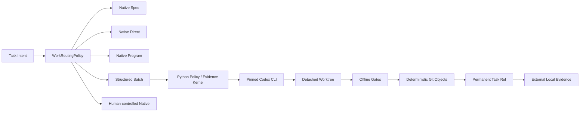

# Local AI Runtime 0.2 v3.18：Unified Native + Batch Deterministic Minimum-Operator Implementation Baseline Candidate

## 1. 结论、规范身份与批准状态

- 唯一规范ID为`local-ai-runtime-0.2-v3.18`。本文是独立、自包含的实施候选基线；实现者不得从v3.17、v3.16、v3.14或任何评审记录补充语义。
- 当前状态为`baseline_candidate`，`blocking_stage=baseline_approval`。规范artifact批准后才允许实施P0/P1；Implementation Acceptance后仍不得进入P2；只有Full Q0通过才开放P2。
- 规范谱系固定为：

```yaml
canonical_predecessor:
  id: local-ai-runtime-0.2-v3.14
  content_sha256: B4133FF27E1FACD0B2B8C48BB89D5FDC4006AD379203BFEF78B4AF6CDAC9DDB2

withdrawn_candidates:
  - id: local-ai-runtime-0.2-v3.16
    content_sha256: 6EAF5320495247661052974333023B1131A1B12A6BFD60BD730975489BB1A9ED

superseded_candidate:
  id: local-ai-runtime-0.2-v3.17
  archived_byte_count: 32825
  provisional_transcript_sha256: A285F5F421A8CCD4DEBD8794609A2AA0EB07BB1BF651C2467A95F7CAD25A5F81
  archive_status: pending_independent_verification

withdrawn_drafts:
  - id: local-ai-runtime-0.2-v3.15
    content_sha256: null
```

- Baseline Approval前必须将完全相同的v3.17 32,825字节正文归档，并由pinned Python `hashlib`和PowerShell `Get-FileHash`独立复算；结果必须等于上述provisional hash，否则拒绝归档，不猜测修复。
- Review文件只进入独立、append-only、hash-linked的`ReviewEvidenceIndex.v1`，不得进入`supersedes`或运行语义hash。
- v3.18正文不嵌入自身hash。归档后由外置`BaselineManifest.v1`记录精确字节hash、Git OID、artifact root和status。
- 规范Markdown验证器只接受strict UTF-8、无BOM、LF、NFC、无行尾SP/HTAB且恰好一个末尾LF；不做任何自动改写。
- 明确拒绝`U+0000..U+0009`、`U+000B..U+001F`、`U+007F..U+009F`、`U+FEFF`以及`U+061C/U+200E..U+200F/U+202A..U+202E/U+2066..U+2069`。唯一允许的C0/C1控制字符是`U+000A`。
- `BaselineApprovalRecord.v1`、`BaselineApprovalRevocationRecord.v1`和`BaselineApprovalSupersessionRecord.v1`均不可变；`ActiveBaselineApprovalMap.v1`以generation CAS指向唯一有效approval。批准记录存在但未处于active map时，不构成有效批准。
- 撤销approval后恢复`blocking_stage=baseline_approval`，禁止新install、activate和claim；默认drain现有attempt。需要终止当前attempt时必须另走耐久`platform kill-current`协议，approval撤销本身不隐式kill。
- 三层门严格分离：

```text
Baseline Approval
-> Implementation Acceptance
-> Full Q0 / P2 Admission
```

## 2. 产品终态、战略与最少人工目标



- 产品终态固定为：**Codex Native Direct/Spec/Program + Python Policy/Evidence Kernel + 全局单writer commit-only Batch + Hermes/AgentBridge/legacy只读compat**。
- Direct、Spec、Program是本产品的路由标签，不声称是Codex CLI flags。
- 目标采用词典序：
  1. 未授权写入、重复writer或副作用、错误Git操作、敏感泄漏、无法解释的对象、错误cleanup和成功的未授权网络出口均为0。
  2. 最小化`net_operator_minutes_per_success`。
  3. 提高无人值守成功率。
  4. 最后优化周期和实际可归属成本。
- 0.2不追求高并发、最大覆盖、多Provider、动态模型路由、自动merge/push或自动处理高风险任务。

| 路由 | 进入条件 | 执行与交付边界 |
|---|---|---|
| `Native Spec` | 高影响歧义、写集合未知或决策不完整 | 最多询问3个关键问题；只形成decision-complete规范，不自动实施 |
| `Native Direct` | 用户在场、任务明确、单一有界写集合 | Codex原生交互；人工检查、集成、merge/push |
| `Native Program` | 至少两个独立写集合且集成顺序固定 | 可用原生subagents/worktrees；人工集成；不继承Batch receipt/fence |
| `Batch` | 四字段submission、allowlisted低风险模板、已资格化、host-local、decision-complete | 无人值守产生唯一runtime commit、task ref和外置证据 |
| `Human-controlled Native` | GUI、生产、数据库、VPS、凭据、远端或不可逆任务 | 人工授权与监督；永不进入Batch |

- 自由prompt永不进入Batch。Spec-to-Batch必须先建立`TaskTemplate`、repo+template qualification、有效Authorization，再由操作者显式submit。
- Batch只接受`repo_id/template_id/parameters/expected_base_commit`；禁止自由prompt、命令、模型、权限、gate、retry、Git策略和环境设置。
- Batch 0.2禁止subagent、多writer、Approval、SDK、Provider/model/sandbox fallback、task-side网络、remote Git、merge/push、target-ref更新和task-ref删除。
- 唯一交付终点是detached worktree内的确定性commit、`refs/heads/codex/batch/<task_uuid>-a<n>`及外置本地证据；target ref保持不变。
- 高风险、含糊、GUI、生产、数据库迁移、VPS、凭据、规则/权限修改和远端副作用继续走Native或人工流程。

## 3. 自治、Operator Action与队列边界

`AutonomyPolicy.v1`固定四级，激活使用generation CAS，运行中不得自动升降级：

| 等级 | 能力 | 晋升条件 |
|---|---|---|
| `B0 probe_only` | qualification、doctor、daily canary，无repo写入 | P1 Implementation Acceptance |
| `B1 manual_drain` | 操作者显式drain一个self-host任务 | Full Q0 |
| `B2 scheduled_single` | 每次计划任务最多执行一个ready task | self-host slice和5个scheduled canary |
| `B3 portfolio` | 在promoted repo/template间确定性调度 | 30-task cohort与逐仓cutover |

- Runtime自动动作仅限准入、claim、唯一writer、mandatory gates、确定性controller closeout、证据发布、安全cleanup及严格证明的pre-execution retry。
- Runtime永不自动执行login/logout、environment准备、Authorization创建/续期、Full Q0、ownership repair、cutover/rollback、Native切换、stale-base改写、模糊reconcile裁决或模型晋升。
- `OperatorActionCatalog.v1`至少包含：
  `platform_login_required`、`authorization_required`、`authorization_renewal_required`、`environment_binding_required`、`qualification_required`、`stale_base_reprepare_required`、`ownership_repair_required`、`native_maintenance_release_required`、`reconcile_required`、`cleanup_required`、`disk_capacity_required`和`backup_quiescence_required`。
- OperatorAction只含受控ID、scope、dedupe key、枚举reason、状态、generation和唯一建议命令；禁止自由文本。相同dedupe key只允许一条open action。
- 全局non-terminal task最多100、单repo最多20、单template ready task最多10；超限拒绝submission并退出3。
- 磁盘准入要求可用空间至少为：

```text
max(
  10 GiB,
  3 * qualified_checkout_bytes
  + 2 * artifact_limit
  + 2 GiB
)
```

- Evidence、被正式对象引用的quarantine和task ref不自动删除；磁盘不足时停止admission，不以删除审计证据维持运行。
- 调度优先级固定为：可能仍有活进程的recovery、可自动完成的recovery/cleanup、再按`ready_at_utc, task_uuid`稳定FIFO处理ready task。Submission无priority字段。

## 4. 架构、安装、升级与文件系统

- P0 Truth Reset后新增`runtime/local-ai-runtime/src/local_ai_runtime/`，采用Python 3.11+模块化单体，边界为：

```text
contracts/
kernel/
qualification/
storage/
execution/
recovery/
git_local/
compat/
```

- 新包不得import、调用或双写`host_orchestrator`。Legacy与新Runtime只共享版本化`RepoRuntimeOwnership` wire contract及named-object算法。
- 生产根固定为`%LOCALAPPDATA%\LocalAIRuntime`：

```text
versions/             immutable runtime versions
policies/             immutable activated policy generations
schemas/              immutable contract generations
state/                SQLite and active maps
authorization/        non-secret authorization objects
auth/                 isolated mutable auth compartment
ownership/            per-repo ownership truth
environments/         immutable environment bindings
runs/                 evidence and receipts
worktrees/            runtime-owned worktrees
temp/                 controller scratch
codex-home/           immutable Codex templates
locks/                marker metadata
quarantine/           isolated incident material
backups/              quiescent state/evidence backups
empty/                managed empty roots
```

- 每个attempt独占可写`CODEX_HOME/CODEX_SQLITE_HOME/HOME/USERPROFILE/APPDATA/LOCALAPPDATA/XDG_CONFIG_HOME/TEMP/TMP/cache/spool`；不同attempt不得共享任何可写HOME、SQLite、TEMP、APPDATA或cache。
- 路径分为`immutable_shared`、`auth_mutable`、`attempt_local_writable`和`managed_empty`四类；schema固定每类identity、ACL、生命周期、允许进程和cleanup责任。
- 每次实际spawn前后验证所有可写root及祖先的最终路径、volume serial、FILE_ID_128、ACL、reparse point和hardlink。可写文件link count必须为1。
- Runtime根、目标repo common-dir、worktree、artifact和evidence必须位于本机固定NTFS卷；UNC、网络盘、可移动盘、cloud placeholder、未知filesystem和可写祖先reparse point均阻断。
- `RuntimeToolchainManifest.v1`锁定Python、uv、`uv.lock`、PowerShell、Git、Node/npm wrapper、`@openai/codex@0.144.1`、bundled `codex.exe`、Windows build、sandbox implementation、Job helper、bootstrap、CapabilityAdapter和Q0 probes的绝对路径、版本、file identity及SHA-256。
- Repo专用dotnet/npm/pytest依赖只进入`QualifiedEnvironmentBinding.v1`，不进入全局toolchain manifest。
- 安装包由受控环境使用预取、hash-pinned wheel/npm bundle和`uv sync --frozen --offline`构建。生产`runtime install`不联网，只验证并写入新immutable version。
- 稳定bootstrap固定为受管PowerShell `-NoProfile -NonInteractive`调用绝对Python `-I -s -E`；禁止PATH或源码树发现runtime。
- `current.json`首次创建使用no-replace；更新使用expected generation/checksum、flush、backup及`ReplaceFileW`类原子替换。
- `runtime activate`要求零active/recovery attempt、verified quiescent backup、candidate Full Q0、migration dry-run和expected current generation；写`RuntimeActivationRecord.v1`后CAS切换。
- `runtime rollback`仅在零active attempt且schema/toolchain向后兼容时允许；不兼容版本必须恢复到隔离root后显式cutover。
- `ClockPolicy.v1`记录UTC、`GetTickCount64`和boot identity。同一boot内lease/timeout只用单调时钟；boot变化时证明所有Job/PID不存在，再等待90秒boot grace。Commit时间使用manifest冻结的UTC秒。

## 5. 契约分层与canonical规则

Tier A维护`Spec + JSON Schema + Example + Catalog + Verifier`：

- `ProductContract`、`BaselineManifest`、`CanonicalizationPolicy`、`WorkRoutingPolicy`、`AutonomyPolicy`、`GuardCatalog`、`OperatorActionCatalog`、`ReasonCodeCatalog`、`ClockPolicy`
- `SubmissionFamilyStatePolicy`、`BatchTaskStatePolicy`、`AttemptStatePolicy`、`PlatformOperationalStatePolicy`、`RepoCutoverMaintenancePolicy`、`TemplateLifecyclePolicy`
- `RepoProfile`、`TaskTemplate`、`BatchSubmission`、`ResolvedBatchManifest`、`Authorization`、`RepoRuntimeOwnership`
- `RuntimeActivationRecord`、`RuntimeToolchainManifest`、`CapabilityQualificationSnapshot`、`QualifiedEnvironmentBinding`
- `CodexFeaturePolicy`、`ProcessEnvironmentPolicy`、`GatePolicy`、`GitConfigPolicy`
- `ReviewEvidenceIndex`、`BaselineApprovalRecord`、`BaselineApprovalRevocationRecord`、`BaselineApprovalSupersessionRecord`
- `ExecutionReceipt`、`EvidenceIndex.v2`、`CloseoutBundle.v2`、`WorkflowEffectMetrics.v1`

Tier B维护schema、migration/compat、golden fixture、round-trip、invariant和recovery tests：

- `QualificationSensitiveInputSet`、`RepoTemplateQualification`、`ResolvedAttemptManifest`
- `SubmissionFamily`、`TaskResolution`、`TaskResubmission`、`AttemptRecord`
- `PromptSnapshot`、`WriterFinalResult`、`AttemptProcessEnvironment`
- `InstructionSnapshot`、`SkillInventory`、`FeatureInventory`、`EffectiveBatchConfigSnapshot`、`AttemptPermissionOverlay`
- `AuthState`、`AttemptAuthorizationContinuation`
- `WriterLaunchRecord`、`WriterSpawnMarker`、`JobIdentity`
- `NormalizedExecutionEvent`、`JournalSegmentManifest`
- `GateReport`、`GitPreflightReport`、`ObjectSetManifest`
- `FencedActionIntent`、`FencedActionAdoption`、`FencedActionHead`、`FencedActionResult`
- `GitAction`、`ArtifactOutboxRecord`、`OperatorAction`、`OperatorWorkSession`
- `RepoCutoverRecord`、`RepoMaintenanceRecord`

- `TemplateExecutionProfile`在首次模型晋升前保持dormant Tier B；首次成为live消费者时升级为Tier A并创建新Authorization generation。
- `Approval`、`NativeCodexReceipt`和`RepoEvidenceProjection`保持draft，不进入0.2 live CLI、DB或catalog。
- Tier C只保留类型、synthetic fixture和测试。Live raw JSONL、probe输出、prompt、reasoning、agent text、command、argv、env、tool I/O和config dump永不持久化。

Canonical JSON规则固定为：

- 解析时拒绝重复key、浮点、非NFC字符串、越界整数和额外字段。
- 对象key按UTF-8字节序排序；编码无多余空白。
- 数组默认保序。只有schema显式标记`set_semantics`时，才按声明的唯一sort key排序；重复key必须拒绝，不能静默去重。
- Git path保留原始Git拼写、大小写和`/`分隔符；NFC仅用于验证，不修改路径。
- 所有内容hash使用domain-separated envelope：

```text
SHA256(
  UTF8("local-ai-runtime/<artifact-name>/<version>\0")
  || canonical_json_bytes_without_self_hash
)
```

## 6. Intake、模板、Qualification与Resubmission

- `BatchSubmission`严格只含`repo_id/template_id/parameters/expected_base_commit`，canonical JSON总计不超过64KiB。
- Repo/template ID匹配`[a-z0-9][a-z0-9._-]{0,63}`；base必须是40位lowercase SHA-1。
- `TaskTemplate`必须提供`additionalProperties=false`的封闭参数schema，只允许有界enum、bool、integer、ID和已批准repo-relative path。
- 参数禁止自由文本、秘密、命令、argv、env、URL、绝对路径、模型、permission、gate、Git ref或不受控路径插值；不得影响executable、gate argv、permission、environment、model或Git策略。
- Relative path拒绝空段、`.`、`..`、ADS、DOS device name、末尾点/空格、绝对路径及symlink traversal。
- `PromptRenderer.v1`只从checked-in静态模板和canonical parameters生成UTF-8 stdin；不执行shell插值。Receipt保存template、parameter和`controller_prompt_sha256`，不保存prompt正文。
- `WriterFinalResult.v1`只允许`schema_version/status/reason_code/changed_paths`；status为`completed|blocked`，changed paths最多200。Controller始终以磁盘和Git审计为真。
- `RepoProfile`必须声明唯一完整`local_base_ref`。Prepare、submit、claim、writer barrier、verify、object promotion和task-ref前均要求该ref精确等于`expected_base_commit`；0.2不支持historical detached base。
- Submission fingerprint为domain-separated canonical envelope，不使用字符串拼接。
- `SubmissionFamily`固定：

```text
submission_fingerprint UNIQUE
root_task_id           immutable
current_task_id        mutable CAS
resubmission_generation monotonic
```

- 普通四字段`batch submit`永久返回generation 0的`root_task_id`，无论family后来是否产生successor。`current_task_id`只由`batch status`和显式resubmission结果展示。
- 合法重做只允许：

```text
batch resolve <source_task_id> --code create_resubmission_v1
```

- 不提供`ResubmissionPermit`、`batch resubmit`或普通submit重做fallback。
- `TaskResolution.v1`保存通用resolution审计；`TaskResubmission.v1`单独表达线性successor关系，至少包含source、successor、resolution record、root、generation和source terminal snapshot hash。
- 约束固定为：

```text
UNIQUE(TaskResubmission.source_task_id)
UNIQUE(TaskResubmission.successor_task_id)
UNIQUE(TaskResubmission.resolution_record_id)
UNIQUE(root_task_id, resubmission_generation)
CHECK(successor_generation = source_generation + 1)
```

- `create_resubmission_v1`先查询既有`TaskResubmission`。存在时只验证记录完整性和调用者读取权限并返回原successor；不得因source已非current、Authorization后来过期或base后来漂移而拒绝重放。
- 尚不存在时，在一个`BEGIN IMMEDIATE`事务中验证：
  source是family current task；状态为`failed|cancelled`；terminal snapshot未变；Job已死；journal/evidence已seal；action均terminal或quarantine；`resume_outcome_unknown=false`；无task-ref成功历史；base、qualification、Authorization和environment仍有效。
- 同一事务写`TaskResolution`、`TaskResubmission`、generation+1 successor，并CAS family current pointer。响应丢失后的重复命令返回同一successor。
- 任一generation已`completed`或历史上成功执行`create_task_ref`，即使ref后来被外部删除，也永久禁止整个family resubmission。
- `stale_base`必须用新base重新prepare/submit，产生新fingerprint和新root task。

## 7. Qualification、Environment、Auth与Authorization

`QualificationSensitiveInputSet.v1`由controller拥有发现权，并使用：

```text
domain
resolver_catalog_id
resolver_catalog_sha256
repo_id
local_base_ref
qualification_commit
entries
final_set_sha256
```

Entry是判别联合：

- `present_git_object`：Git path、独立NTFS collision key、mode、object type、Git OID、resolver rule、discovery source和sensitivity class。
- `absent_candidate`：预期不存在的候选路径、collision key、发现规则和negative-discovery依据。
- `directory_or_glob_expansion`：规则ID、root、pattern、排序后的成员键及membership hash。
- `blocked_external_reference`：来源Git对象、外部目标类别和枚举阻断原因；存在即qualification失败。

规则固定为：

- Repo内容只从`qualification_commit`的Git tree读取；原仓index/worktree不得代替Git对象。
- Dirty、staged或untracked内容命中敏感路径、发现入口或其祖先时阻断，不把工作树hash混入Authorization。
- RepoProfile、TaskTemplate和gate声明只能增加输入，不能排除controller发现项。
- 递归解析MSBuild imports、Directory.Build文件、`global.json`、Node scripts/config、Python/Node/.NET锁文件、pytest配置、嵌套`conftest.py`、gate脚本及静态间接输入。
- 无法闭合的动态加载扩大到完整目录/配置类别；repo外引用、未知入口、active submodule或必须依赖dirty/untracked输入的模板不予资格化。
- Git path与Windows collision key始终是两个字段；大小写碰撞、ADS、device path或无效UTF-8直接阻断。
- Set按schema声明的唯一键排序；重复collision key拒绝。最终hash必须可由独立verifier复算。

`QualifiedEnvironmentBinding.v1`：

- 内容寻址、不可变，绑定repo+template qualification generation。
- 绑定lock hash、bundle identity、volume/file identity、ACL、dependency-tree manifest/hash、全部可执行文件和DLL hash、只读依赖/cache、attempt-local writable cache、每个gate的绝对argv/env、reparse/hardlink审计。
- Bundle由操作者在Batch外准备。Batch只register、verify和挂接，不restore/install/bootstrap、执行setup脚本或联网。
- `retire`只禁止新引用；0.2不提供物理删除。缺失或漂移进入`needs_environment`。

`AuthState.v1`是单Provider全局状态：

- 只保存`auth_generation/store/status/last_qualified_at`；不保存credential内容、hash、mtime或代理凭据。
- 固定`cli_auth_credentials_store="keyring"`；keyring不可用即Q0失败，无file/auto fallback。
- `needs_auth`停止全部provider claim和scheduled retry，并按`(platform_login_required, auth_generation)`创建唯一OperatorAction。
- 只有交互式`platform login`改变auth generation并通过quick qualification后才能关闭旧action和恢复claim。
- Scheduled入口禁止login/logout。

Authorization：

- 内容寻址、只写一次；active map为`(repo_id,template_id)->authorization_id,generation`。
- 默认有效30天；claim及新resubmission时剩余有效期必须至少为12,000秒，即attempt deadline 11,700秒加5分钟。
- 绑定SID、repo/template/profile/gates、Git policy、InstructionSnapshot、SkillInventory、QualificationSensitiveInputSet、QualifiedEnvironmentBinding、toolchain、model/effort、evidence mode、风险和limits。
- Submit、claim、writer spawn、每次heartbeat、verify、每个gate、object promotion、finalize、task-ref、evidence和cleanup前重验generation、revoke、expiry、sensitive fingerprint、qualification、environment/toolchain及base。
- Authorization变化时关闭运行Job。无需新Authorization即可终止Job、排空管道、seal journal、只读reconcile、quarantine、发布恢复证据和park。
- 新Authorization继续旧attempt必须建立唯一`AttemptAuthorizationContinuation.v1`，绑定旧/新Authorization、generation、旧/新fence、冻结manifest、marker/receipt hash及允许阶段`verify|closeout|cleanup`。Writer永不重跑。

## 8. Codex、permission overlay与进程隔离

Writer唯一入口：

```text
<pinned-codex> exec <writer-overlay-argv>
  --ephemeral --json --strict-config --ignore-rules
  -p batch -C <worktree> -m gpt-5.6-sol
  --output-schema <writer-final-schema> -
```

Gate和Git唯一入口：

```text
<pinned-codex> sandbox -p batch
  -P <batch-gate|batch-git-audit|batch-git-local>
  -C <logical-cwd> <overlay-argv>
  -- <absolute-executable> <argv...>
```

- `exec`不得使用`-P`；所有进程禁止SDK、系统CLI或普通subprocess fallback。
- Batch profile固定`default_permissions="batch-writer"`、`model_reasoning_effort="high"`、`approval_policy="never"`、`web_search="disabled"`、`history.persistence="none"`、`allow_login_shell=false`、`shell_environment_policy.inherit="none"`、`windows.sandbox="elevated"`、`check_for_update_on_startup=false`、`analytics.enabled=false`和`feedback.enabled=false`。
- Permission profile不得与legacy`sandbox_mode/sandbox_workspace_write/--sandbox/-s`混用。
- Overlay无条件生成：

```toml
projects."<canonical-worktree>".trust_level = "untrusted"
```

- `--ignore-rules`不能替代untrusted project。Effective config必须证明project-local`.codex` config、hooks和rules未进入执行面；AGENTS、skills、Git attributes和repo内容仍由独立inventory审计。
- `PermissionOverlayCompiler`生成argv数组，不生成shell字符串；最多64个`-c`，overlay编码后最多16,384个UTF-16 code units，完整CreateProcess命令行小于32,767。
- 在创建AttemptRecord前，以内存预分配的attempt UUID/path完成TOML、Windows path及`CommandLineToArgvW` round-trip；超限退出6。
- Receipt绑定compiler input hash、compiler version/hash、逻辑根替换后的安全投影、有序digest、effective-config hash、feature/tool inventory ID和qualification probe ID；raw argv永不持久化。
- `CodexFeaturePolicy.v1`逐项分类0.144.1全部feature为`required_enabled/allowed_internal/required_disabled/removed_ignored`，并绑定model-visible tool inventory。未知且effective=true、removed项重新暴露tool或feature生命周期漂移均失败。
- Apps、plugins、hooks、MCP、memories、goals、multi-agent、remote plugin、browser/computer-use、image generation、tool suggestions、workspace dependencies、shell snapshot、skill dependency installation、updates和OTEL均关闭或证明无模型可见表面。
- `CodexCapabilityAdapter`是唯一了解CLI flags、config keys、feature和JSONL事件的模块；版本差异不得扩散到policy、storage或Git模块。
- `codex debug prompt-input`不能等价复现真实`exec -p/-C/--strict-config`，因此不声明`final_prompt_input_sha256`。只保存controller prompt、ordered instructions、skill inventory、effective config、feature/tool inventory和output schema的独立hash。

所有writer、gate、Git和recovery probe从空环境构造：

```text
CODEX_HOME         = <attempt>/process/codex-home
CODEX_SQLITE_HOME  = <attempt>/process/codex-sqlite
HOME               = <attempt>/process/empty/home
USERPROFILE        = <attempt>/process/empty/home
APPDATA            = <attempt>/process/empty/appdata
LOCALAPPDATA       = <attempt>/process/empty/localappdata
XDG_CONFIG_HOME    = <attempt>/process/empty/xdg
TEMP/TMP           = <attempt>/process/scratch/<spawn_id>/temp
SYSTEMROOT/WINDIR/COMSPEC/PATHEXT/PATH = rebuilt from manifests
```

- 清除代理、API key、SSH、askpass、shell profile、`PYTHON*`、`NODE*`和所有继承`GIT_*`。
- 只有Codex parent可获得Q0批准的非秘密provider proxy endpoint；凭据只来自受管keyring。Model工具、gate和Git均无task-side network及auth/proxy变量。
- Gate所需`VIRTUAL_ENV/NODE_PATH/NUGET_PACKAGES`等只由QualifiedEnvironmentBinding显式加入。
- Codex和Git parent从受管空CWD启动，通过`-C`选择repo；Gate因语义需要可使用worktree CWD，但必须在sandbox和environment binding内。
- Launcher使用受控DLL搜索路径；Q0验证DLL side-loading和hardlink escape。
- `InstructionSnapshot.v1`绑定受管global AGENTS和完整project AGENTS链、顺序、OID/hash/bytes及预算。Global上限8,192 bytes，project chain总上限32,768 bytes，`project_doc_fallback_filenames=[]`、`project_doc_max_bytes=32768`；未知文件、截断或漂移阻断。
- `SkillInventory.v1`覆盖repo/user/admin/system及symlink最终目标。受管HOME隔离真实用户skills；repo skills默认禁用。只读skill symlink仅在最终目标位于批准根且identity/OID/tree hash/file hash完全匹配时允许。
- Stdout/stderr必须异步、有界、持续排空；正文和内容hash不持久化。读取到limit+1立即关闭整个Job。

## 9. 状态域、Guard优先级与公共恢复语义

状态策略拆分为：

- `SubmissionFamilyStatePolicy.v1`
- `BatchTaskStatePolicy.v1`
- `AttemptStatePolicy.v1`
- `PlatformOperationalStatePolicy.v1`
- `RepoCutoverMaintenancePolicy.v1`
- `TemplateLifecyclePolicy.v1`
- `AutonomyPolicy.v1`
- `OperatorActionCatalog.v1`

`GuardCatalog.v1`使用固定优先级，数值越小越先评估：

| 优先级 | Scope | 内容 |
|---|---|---|
| 10 | baseline/runtime | approval、activation、schema和toolchain |
| 20 | platform | manual suspend、auth、Q0、unavailable/incompatible |
| 30 | repo | ownership、maintenance、cutover、repo qualification |
| 40 | template | qualification、Authorization、environment、base |
| 50 | attempt | Job、fence、marker、recovery和action head |
| 60 | task | task state、retry/resubmission、capacity和queue |
| 70 | operation | 当前命令的业务guard |

- 每个guard绑定scope、输入snapshot hash、reason code和依赖guard；依赖只能指向更高优先级，verifier必须证明无环。
- 未知state、operation、resolution或guard组合统一退出2且零副作用。

核心transition rows固定为：

| Domain/Source | Operation | 必要guard | 允许副作用 | Target/Exit/Capacity |
|---|---|---|---|---|
| 无family | ordinary submit | schema/base/qualification | 创建root generation 0 | queued或对应needs状态，0/3 |
| 已有family | ordinary submit | read permission | 无，返回root | family不变，0 |
| current failed/cancelled | `create_resubmission_v1` | 完整resubmission guard | 原子创建唯一successor | queued或needs状态，0/3 |
| queued | cancel | 无spawn intent/process | 记录cancel | cancelled，0，释放 |
| running/verifying | cancel | 当前fence | 耐久kill intent、终止Job、seal/handoff | recovery_required，3，完成handoff后释放 |
| closing | cancel | 当前fence | 仅记录枚举请求 | closing，`accepted_deferred`，0，继续持有 |
| pre-execution failure | retry | attempt<3、零execution commit | 新attempt/worktree | queued，0 |
| recovery_required | reconcile | 只读guard | 只读核对并写报告 | 原状态或recovery_pending，0/3 |
| verifying | continue_verify | Authorization continuation | 新gate/verify，不启动writer | verifying/closing，0/4 |
| closing | continue_closeout | 当前action head和Authorization | 确定性closeout | closing/completed，0/4 |
| cleanup_required | retry_cleanup | runtime ownership和clean proof | 精确cleanup | completed/cleanup_required，0/3 |
| blocked/recovery | terminate_failed | Job死、evidence sealed | 终结记录 | failed，0 |
| 旧fence action | adopt | 旧Job死、expected result确定 | 写adoption+head CAS | action继续，0/3 |
| active attempt | Authorization continuation | writer不重跑 | 建continuation | verify/closeout/cleanup，0/3 |
| healthy | maintenance request | interactive session | durable drain request | draining，0，等待capacity |
| maintenance | maintenance end | scan+quick verify | owner恢复或资格失效 | prior owner/requalification，0/3 |
| platform healthy | suspend | interactive operator | 停止新claim | manual_suspended，0 |
| active attempt | kill-current | durable kill intent | 终止Job、drain、seal、handoff | recovery_pending/required，0/3 |
| suspended | resume | Full Q0有效 | 清除平台阻断 | healthy，0 |
| quiescent | backup create | 全repo锁、零pending | SQLite/evidence backup | 状态不变，0/3 |
| eligible repo | cutover/rollback | interactive、backup、零active | ownership CAS | batch_owned/legacy_owned，0/3 |

Platform状态固定为`healthy/manual_suspended/draining/needs_auth/platform_unavailable/qualification_suspended/platform_incompatible`：

- `platform_unavailable`遵循`Retry-After`，否则5m→15m→1h→6h。
- `needs_auth`停止重试，直到auth generation变化并通过quick qualification。
- Daily canary基础设施故障只独立重试一次，仍失败进入`qualification_suspended`并停止claim。
- Binary/config/profile/permission/sandbox/feature/tool/adapter行为漂移进入`platform_incompatible`。
- 单任务输出超限只失败当前attempt，除非独立Q0证明是平台行为漂移。
- Repo/template失败只暂停对应scope；只有平台执行面可疑时才全局stop-the-line并要求Full Q0。

退出码固定：

```text
0 success or no ready task
2 input/schema/state contract error
3 policy/Authorization/ownership/base/environment/manual recovery block
4 gate/evidence/eval/attempt failure
5 platform_unavailable | needs_auth | qualification_suspended
6 platform_incompatible
```

## 10. Ownership、named objects、Job与writer最多一次

Ownership真源：

```text
%LOCALAPPDATA%\LocalAIRuntime\ownership\<repo_id>.json
```

至少包含`schema_version/registry_generation/repo_id/common_dir_path_key/volume_serial/file_id_128/owner_mode/generation/status/checksum`。

- 首次创建使用`CREATE_NEW`；更新使用expected generation/checksum、temp+flush、backup和`ReplaceFileW`类原子替换。
- 损坏时只允许自动采用identity一致且generation不倒退的backup；否则进入interactive ownership repair。
- Legacy v1、runtime_v2实验线和新Batch必须共同消费repo mutex及ownership generation，覆盖claim、lease、worktree、writer、repo写入、Git、closeout和cleanup；guard conformance通过前新Batch不得claim。

Named objects：

```text
SID = ConvertSidToStringSidW(current token SID)
SIDHash = lowercase(SHA256(UTF8(SID)))[:16]

RepoIdentity = "v1|<volume_serial_16hex>|<file_id_128_32hex>"
RepoIdentityHash = lowercase(SHA256(UTF8(RepoIdentity)))[:24]

Global\LocalAIRuntime.BatchDrain.<SIDHash>.v1
Global\LocalAIRuntime.RepoOwnership.<SIDHash>.<RepoIdentityHash>.v1
Global\LocalAIRuntime.Attempt.<SIDHash>.<attempt_uuid>.v1
```

- 名称不超过240个UTF-16 code units。
- SDDL固定为`O:<SID>G:<SID>D:P(A;;GA;;;SY)(A;;GA;;;<SID>)`。
- 打开既有named object时验证object type、owner/group、DACL和Job limits；不匹配进入`platform_incompatible`。
- 锁顺序固定为global capacity → 按canonical repo identity排序的repo mutex → SQLite `BEGIN IMMEDIATE`。
- 全局capacity为1；heartbeat 15秒、TTL 90秒。Manual、scheduled、doctor、backup、maintenance和recovery使用同一算法。

Job创建：

- 使用`CreateProcessW(CREATE_SUSPENDED | EXTENDED_STARTUPINFO_PRESENT)`及`PROC_THREAD_ATTRIBUTE_JOB_LIST`，在进程创建时原子加入kill-on-close、no-breakaway named Job。
- 在resume前持久化Job name、attempt/fence、controller PID/creation time、writer PID/creation time及primary thread identity。
- 禁止“先CreateProcess、后AssignJob”的窗口。
- 同名Job存在时，即使零进程也不能创建或恢复process-bearing Job。
- 检查和重建全程持有attempt mutex：`OpenJobObject`检查 → 关闭检查handle → `CreateJobObject`。若返回`ERROR_ALREADY_EXISTS`，关闭该handle并进入`recovery_pending/job_handle_still_open`。
- Runtime不得声称删除其他进程持有的Job handle，不得换名绕过。Runbook只能等待持有者退出、终止精确验证的runtime进程，或明确授权重启宿主。
- Takeover同时要求旧mutex释放、Job process list为空或对象消失、全部PID+creation time不存活、TTL/boot grace满足及fencing CAS成功；优先恢复旧attempt。

Writer启动状态：

```text
launch_intent
-> durable_marker
-> spawned_suspended
   -> terminated_before_execution_commit
   -> writer_execution_committed
      -> resume_observed
      -> resume_outcome_unknown
         -> process_exited | recovery_required
```

顺序固定为：

1. DB提交`launch_intent`。
2. 使用`CREATE_NEW | FILE_FLAG_WRITE_THROUGH`创建marker，`FlushFileBuffers`并关闭。
3. DB提交`durable_marker`；claim前扫描孤儿marker并CAS收录。
4. 最终Authorization/base/Job/fence preflight。
5. 原子创建suspended process和Job membership。
6. 持久化PID/creation time及`spawned_suspended`。
7. 在`ResumeThread`前flush `writer_execution_committed`。
8. 调用ResumeThread并记录`resume_observed`或`resume_outcome_unknown`。
9. 进程结束后记录`process_exited`，再判断receipt条件。

规则：

- 只有`launch_intent|durable_marker`且Job/PID均不存在时，允许继续同一尚未创建进程的launch intent。
- 处于`spawned_suspended`且从未写execution commit时，可终止仍suspended的Job、等待PID退出、写`terminated_before_execution_commit`，再创建新attempt；不得复用旧attempt。
- `writer_execution_committed`永久禁止当前`task_id/resubmission_generation`创建任何新writer attempt。零tool、零mutation或未知ResumeThread结果都不能推翻该barrier。
- 原writer仍可被观察、终止、排空、seal和只读reconcile，但不得替换。
- 完整terminal、无resume歧义且满足全部resubmission guard的显式successor task可启动自己的唯一writer。
- 任一generation完成、发布task ref或被scope安全策略永久停用时，整个family禁止继续writer。

## 11. Fenced controller action、SQLite与事件恢复

Fenced action拆分为：

```text
FencedActionIntent.v1      immutable
FencedActionAdoption.v1    immutable append-only
FencedActionHead.v1        mutable CAS
FencedActionResult.v1      immutable terminal
```

- 创建intent时在同一事务创建初始head：`current_head_kind=intent/current_head_hash=intent_hash/current_fence=origin_fence/version=1`。
- 首次adoption的`prior_head_hash`必须指向intent hash；后续指向前一adoption hash，永不使用NULL。
- 插入adoption与CAS更新head必须在同一`BEGIN IMMEDIATE`事务。
- 约束至少为：

```text
PRIMARY KEY(FencedActionHead.action_id)
UNIQUE(FencedActionAdoption.action_id, prior_head_hash)
UNIQUE(FencedActionResult.action_id)
prior_head_hash NOT NULL
```

- Result写入前验证result不存在、head hash/fence/version匹配；terminal result存在后永久禁止adoption。
- 可收养动作仅限`create_worktree`、`checkout_base`、`artifact_publish`、`materialize_object_set`、`promote_objects`、`finalize_index`、`finalize_head`、`create_task_ref`、`evidence_publish`、`remove_worktree`和已耐久授权的`terminate_job`。
- Writer、spawn、gate、qualification、auth refresh、自由命令和需重新决策的动作永不可收养。

SQLite固定：

```text
journal_mode=DELETE
foreign_keys=ON
synchronous=FULL
busy_timeout=5000
short transactions only
```

核心表必须覆盖：

- schema migrations、baseline approvals/active map
- submission families、tasks、task resolutions/resubmissions
- attempts、leases、writer launch/markers、Job identity
- events、journal segments
- artifacts、outbox
- fenced action intents/adoptions/heads/results
- Git actions、object sets
- authorizations、active maps、continuations
- auth state、environment bindings、qualifications
- runtime activations、repo ownership/cutover/maintenance
- operator actions/work sessions、backup manifests

所有attempt副作用记录绑定`attempt_id+fencing_token`，通过复合FK/trigger拒绝旧fence。UNIQUE至少覆盖task idempotency、`(task_id,attempt_no)`、单active attempt、writer marker、`(attempt_id,event_seq)`、segment number、action input、task ref、artifact logical name、Authorization active generation和单global capacity lease。

`NormalizedExecutionEvent.v1`：

公共必需字段：

```text
schema_version
attempt_id
fencing_token
seq
observed_at_utc
event_type
status
prev_hash
event_hash
```

- `observed_at_utc`固定为`YYYY-MM-DDTHH:mm:ss.ffffffZ`。
- 禁止null、额外字段、自由文本、reasoning、agent text、command、argv、env、prompt和tool I/O。
- Event types固定为：
  `process_started/turn_started/tool_started/tool_completed/tool_failed/mutation_observed/content_validated/mutation_quarantined/turn_completed/turn_failed/process_exited/stream_eof/final_result_validated/adapter_rejected/journal_sealed`。
- Status固定为`started/observed/completed/failed/rejected`。
- `item_id`只允许tool事件；`exit_code`只允许tool终结和process_exited；usage只允许turn_completed；failed/rejected必须有catalog reason code；successful event禁止reason code。
- `mutation_observed`只保存CSPRNG生成的`mutation_observation_id`、byte count、枚举path class及可选非秘密`approved_path_id`。
- 未批准路径禁止保存原文、普通digest或无key hash。
- 路径和内容均通过policy及secret scan后，新追加的`content_validated`才可保存canonical relative path、content SHA-256和byte count。
- 扫描失败只保存随机、非派生的`quarantine_id`、byte count和枚举reason；既有event永不修改。
- `event_hash`使用domain-separated canonical event并排除自身字段；首条prev hash为64个零。
- ID最长128 ASCII，hash为64 lowercase hex，整数不超过int64，单event不超过16KiB。

Journal：

- Raw Codex JSONL只在内存逐行解析，永不落盘。
- Normalized journal执行append → `FlushFileBuffers` → SQLite cursor/hash事务；DB只能落后journal。
- 单行raw JSONL最多256KiB，normalized journal总计8MiB。
- 完整换行但非法JSON/schema/event表示CLI/adapter不兼容，关闭Job并进入`platform_incompatible`。
- Cancel、timeout、limit kill或异常process crash留下的partial EOF只属于attempt recovery；正常exit后仍有partial line才是framing incompatibility。
- 损坏normalized segment不截断、不继续追加；封存原segment，以`previous_segment_seal_hash + accepted_end_offset`创建continuation。
- `JournalSegmentManifest.v1`保存segment number、前段seal hash、accepted offset、seq range、byte count、content hash和seal hash。Raw CLI异常字节不进入quarantine。
- Terminal `ExecutionReceipt`只有在Codex process exit、JSONL EOF、final schema通过、全部output limits未超、event/segment chain seal完成且Job内无活进程六项同时成立时发布。

## 12. Artifact、Evidence、Quarantine与Backup

Artifact顺序固定为：

```text
deterministic spool temp write + flush
-> SQLite fence-bound outbox intent
-> same-directory final temp CREATE_NEW + flush
-> no-replace atomic rename
-> read-back hash/size
-> SQLite published terminal
```

- 禁止`os.replace`覆盖final。
- Final存在时只在同intent/hash/size时幂等确认，否则quarantine。
- Intent前孤儿temp采用`<attempt>.<logical-name>.<nonce>.orphan`确定性可识别命名，扫描后quarantine，不自动收养。
- Artifact publish必须通过FencedAction协议。
- 正式evidence位于`runs/<repo>/<run>/<task>/<attempt>`，append-only、hash-linked、tamper-evident但不宣称WORM。
- 目标repo必须在RepoProfile中明确接受`external_local_evidence_id_and_hash`；否则不得进入writer pilot。0.2不写tracked evidence projection。
- Evidence只保存受控ID、枚举状态、byte counts、通过secret scan的canonical diff、正式artifact hash、Git对象/ref和qualification ID。
- Prompt、reasoning、tool正文、stdout/stderr、auth、env值、proxy值和未经验证的路径/hash永不进入evidence。
- Quarantine分为：
  - `non_sensitive_sealed`：已证明不含敏感信息，可在被terminal对象引用时进入普通backup。
  - `sensitive_isolated`：secret hit原始材料，仅当前SID/SYSTEM ACL，永不进入普通evidence或普通backup；terminal evidence只引用随机ID、byte count和reason。
- Quarantine ID不得由路径或内容派生。

Backup固定为quiescent state/evidence backup：

1. 取得global capacity。
2. 按canonical repo identity排序取得所有被备份状态引用的repo mutex。
3. 要求零active lease、零non-terminal/recovery attempt、零pending outbox及零executing fenced/Git action。
4. 使用SQLite Backup API创建快照。
5. 收集terminal outbox引用的immutable artifact及允许备份的sealed quarantine。
6. 写backup manifest和hash。

- 不满足quiescence退出3，不做部分backup。
- 普通backup包含DB、terminal evidence、ownership、Authorization、activation、environment/toolchain/policy references及non-sensitive sealed quarantine。
- 排除auth、proxy、mutable CODEX_HOME、sensitive quarantine、worktree、非terminal spool/journal、runtime binary和environment内容。
- Restore drill只恢复到新隔离root，验证schema、activation、ownership、evidence chain和引用；不得覆盖生产root。
- Runtime backup不声称可恢复目标repo Git objects或task refs；这些依赖repo自身备份。

## 13. Git审计、对象闭包与确定性发布

第一条Git读取必须已位于`batch-git-audit`、最终overlay、Job和hardened environment中：

```text
git config --local --no-includes --null --name-only --list
```

Git环境固定：

```text
GIT_CONFIG_NOSYSTEM=1
GIT_CONFIG_GLOBAL=NUL
GIT_CONFIG_SYSTEM=NUL
GIT_ATTR_NOSYSTEM=1
GIT_TERMINAL_PROMPT=0
GIT_OPTIONAL_LOCKS=0
GIT_NO_REPLACE_OBJECTS=1
```

- 清除所有继承`GIT_*`、SSH、askpass、proxy、diff、namespace、config count/key/value和object/index/worktree注入。
- `GIT_DIR/GIT_WORK_TREE/GIT_COMMON_DIR/GIT_INDEX_FILE/GIT_OBJECT_DIRECTORY/GIT_ALTERNATE_OBJECT_DIRECTORIES/GIT_EXEC_PATH/GIT_TEMPLATE_DIR/GIT_NAMESPACE`只能由Git adapter按单次operation设置。
- 每条Git命令设置受管空hooks/excludes、`commit.gpgSign=false`、`core.fsmonitor=false`、`core.logAllRefUpdates=false`、`gc.auto=0`和`maintenance.auto=false`；diff固定`--no-ext-diff --no-textconv`。

`GitConfigPolicy.v1`按ASCII case-insensitive full key分类：

- `deny_always`：include/includeIf、credential、http header/proxy、filter/process、diff/textconv、merge driver、hooks、signing、fsmonitor、SSH、URL rewrite、upload/receive-pack、protocol、submodule、alternate refs、alias/editor/pager、external attributes/excludes及`extensions.worktreeConfig=true`。
- `allow_name_only`：remote URL/fetch/push、branch tracking、LFS endpoint/access；不读取或持久化value，可能含URL的raw key也不进入日志。
- `allow_safe_value`：
  `core.repositoryformatversion=0`、`core.bare=false`、`extensions.objectformat=sha1`、`extensions.refstorage=files`；
  catalog化的`core.filemode/logAllRefUpdates/symlinks/ignorecase/protectNTFS/protectHFS/longpaths` boolean；
  `core.autocrlf=false|true|input`、`core.eol=lf|crlf|native`、`core.safecrlf=false|true|warn`。
- 未分类key、重复singleton、非法boolean或范围外value一律阻断。

Preflight审计：

- Local/worktree config、default hooks、`.git/info/attributes`、`.git/info/exclude`、alternates、replace refs、grafts。
- Base tree全部`.gitattributes/.gitmodules/.lfsconfig`、Git link entries及touched-path `check-attr -a`。
- 拒绝SHA-256 object format、reftable、shallow、partial/promisor clone、sparse checkout、alternates、replace/grafts、active submodule、LFS filter及external filter/driver。
- Protected surfaces记录base path/mode/OID/hash；writer后再次验证。
- Spawn前和writer后扫描全部writable roots及祖先；任何新reparse point、hardlink escape或protected delta阻断。

发布链固定为：

```text
ownership/fence
-> hardened repo audit
-> create_worktree
-> checkout_base
-> writer
-> protected/writable-root rescan
-> offline mandatory gates
-> attempt-local index and object graph
-> seal ObjectSetManifest
-> promote_objects
-> common-store reachability
-> finalize_worktree_index
-> finalize_worktree_head
-> create_task_ref
-> publish evidence
-> remove_worktree
```

Object graph：

- Changed blobs、trees和commit先在attempt-local`GIT_OBJECT_DIRECTORY`生成，以base common objects作只读alternates。
- Controlled index从expected base执行`read-tree`，只stage批准delta。
- `ObjectSetManifest.v1`按type/OID排序，记录type、OID、size、payload SHA-256和edge OIDs。
- 触碰common object store前必须封存manifest及expected tree/commit OID。
- `promote_objects`先写FencedAction intent，再逐对象create-if-absent。
- 已存在对象通过Git canonical type、size和payload重算OID；禁止比较loose-object zlib字节。
- 清除alternates后验证commit/tree/blobs在common store完整可达；无法解释对象、缺失edge或OID冲突进入`reconcile_required`。

Commit payload严格为：

```text
tree <tree_oid>\n
parent <expected_base_commit>\n
author Local AI Runtime <local-ai-runtime@localhost.invalid> <claim_epoch_seconds> +0000\n
committer Local AI Runtime <local-ai-runtime@localhost.invalid> <claim_epoch_seconds> +0000\n
\n
batch(<template_id>): <task_uuid> attempt <n>\n
\n
Manifest: sha256:<resolved_manifest_sha256>\n
```

- 恰好一个parent，无encoding、gpgsig、mergetag或其他header。
- Claim时间在manifest中冻结为UTC整秒。
- Commit message不包含最终evidence ID，避免commit/evidence内容寻址环。
- Controller预计算expected SHA并写intent；promotion后验证canonical payload。

Finalize：

- 禁止`reset --hard`。
- 先证明tracked path、mode和字节等于expected tree，且没有未批准的untracked或ignored文件。
- 以expected-tree临时index生成并验证真实worktree index metadata。
- 然后CAS更新detached HEAD并验证HEAD、index tree和worktree一致。
- Finalize index和HEAD是独立fence-bound action；任何失败或歧义都不得创建task ref。

Task ref：

```text
refs/heads/codex/batch/<task_uuid>-a<attempt_no>
```

- Attempt number为1..3，ASCII，不超过240 bytes并通过`git check-ref-format`。
- 使用`git update-ref <ref> <expected_commit> <zero_oid>`，只允许精确ref及其lock写面，reflog关闭。
- 不确定结果只能按expected ref/OID只读核对，不搜索或重复生成dangling commit。
- Task ref成功后才发布terminal evidence；ref存在而evidence未完成必须恢复，不能重跑writer。
- Evidence terminal后只对runtime-owned、Job已终止、fence匹配、action terminal且HEAD/index/worktree完全干净的worktree执行非force remove。
- Remove后验证目录和common-dir admin entry均消失；禁止全局prune。Dirty、recovery或不确定状态保留。Task ref永久保留。

## 14. 受管Native、紧急终止与逐仓迁移

Batch-managed repo的受支持Native写操作只能通过：

```text
native launch --repo <repo_id> --mode <direct|spec|program>
```

- Launcher只在真实交互控制台运行，不接受自由argv、env、model、permission或Git参数；它启动manifest锁定的Native Codex交互入口。Prompt仍由用户在Codex原生界面输入。
- 裸Codex/Git写入明确为unsupported；不安装全局Git hook，也不声称拦截已攻陷的同SID controller。
- 正常Native流程：

```text
durable maintenance_drain_requested
-> stop new Batch claims
-> wait current attempt terminal
-> acquire global capacity
-> acquire repo mutex and ownership generation
-> enter durable maintenance
-> managed Native launcher
-> maintenance-end scan
-> quick verify or requalification
-> release capacity
-> resume unaffected scheduling
```

- 正常maintenance不得kill当前attempt，不设置TTL自动解除。
- 无敏感漂移时恢复保存的prior owner并完成quick verify。
- 敏感漂移时撤销repo/template qualification及Authorization，进入`repo_requalification_required`或`template_qualification_suspended`。
- 扫描不完整或有歧义时保持maintenance并生成去重OperatorAction。
- Platform resume只清除global drain/suspend，不得覆盖repo/template阻断；其他repo可恢复调度。

`platform kill-current`是独立紧急操作：

1. 耐久写`OperatorWorkSession`、枚举reason和`FencedActionIntent(terminate_job)`。
2. Flush kill intent。
3. 才允许终止/关闭Job。
4. 持续排空管道、seal journal并进入recovery handoff。
5. 崩溃后新fence只能收养同一`terminate_job`动作；terminal result必须绑定完整JobIdentity和全部PID死亡证明。

逐仓迁移：

```text
legacy_owned
-> shared_guard
-> batch_qualified
-> cutover_pending
-> batch_owned
-> rollback_pending
-> legacy_owned
-> retired
```

- `shared_guard`要求host-orchestrator v1、runtime_v2实验写面和新Batch全部接入同一ownership、repo mutex和generation。
- `batch_qualified`要求Full Q0、repo/template qualification、Authorization、environment binding、external evidence接受及cutover/rollback drill均有效。
- Cutover只允许interactive operator，要求双方零active/closing、verified backup、expected ownership generation、当前SID及显式repo确认；写`RepoCutoverRecord`并CAS owner。
- 未cutover repo的legacy DB继续可写。Cutover后legacy writer fail-closed，但历史DB保持可读；未终态legacy任务必须先完成或显式终结，不迁移为Batch attempt，不双写数据库。
- Rollback要求零Batch active/closing、所有controller action terminal或park、task ref/evidence已核验及expected generation。
- Runtime commit、task ref和evidence在rollback后永久保留；legacy不得重复执行对应任务。
- 全部目标repo cutover、零legacy active/closing且rollback drill通过后，旧DB才转只读；连续30天零legacy写入口调用后删除旧写面。
- Hermes、AgentBridge、host-orchestrator历史evidence和compat reader永久只读保留。Compat不claim、不lease、不commit、不写projection、不参与新DB。

## 15. 公共CLI、Scheduler与运营入口

```text
baseline status|verify|approve|revoke|supersede
runtime install|status|activate|rollback
platform setup|login|logout|auth-status|model-probe|sandbox-probe|qualify|doctor|suspend|resume|kill-current
native launch|status
repo register|verify|qualify|cutover|rollback|ownership-status|ownership-repair|maintenance-begin|maintenance-status|maintenance-end
environment register|verify|status|retire
authorization activate|revoke|status|verify
policy evaluate
batch prepare|submit|drain|status|cancel|retry|reconcile|resolve|doctor
contracts catalog|verify
gates run|verify
evidence verify
backup create|verify|restore-drill
eval baseline|compare|work-session-start|work-session-stop|work-session-status
schedule install|status|run-now|remove
compat verify
```

- 所有CLI提供稳定`--json`结果；scheduler强制JSON。
- 非零结果必须含稳定reason code、evidence locator和唯一建议命令。
- `gates run`只用于qualification或诊断，仍使用相同sandbox/policy；不得生成closeout。
- Evidence closeout只能由持有当前fence的Batch closing状态机执行。
- Ownership repair、baseline approval/revoke、runtime activate/rollback、Native、cutover/rollback及kill-current只允许真实交互控制台。
- Scheduler使用当前用户`InteractiveToken`、`Limited`、`Hidden`、`StartWhenAvailable`、`IgnoreNew`，每5分钟、每次最多drain一个task，`ExecutionTimeLimit=12600s`。
- Scheduled入口禁止login/logout、environment preparation、Full Q0、ownership repair、baseline操作、cutover/rollback、Native和模型晋升。

资源限制：

```text
writer timeout                 3600s
single gate timeout            1800s
all gates timeout              7200s
closeout timeout                900s
attempt timeout               11700s
scheduler timeout             12600s

writer JSONL+stdout              8MiB
writer stderr                    8MiB
single JSONL line              256KiB
single normalized event         16KiB
normalized journal total         8MiB
final structured result          1MiB
other process stdout/stderr       8MiB each
diff                             16MiB
changed files                    200
artifacts total                 256MiB
```

所有limit必须覆盖`limit-1/limit/limit+1`。超限立即关闭整个Job，不得截断后判成功。

## 16. Q0生命周期与能力冻结

- Full Q0在install、activate及Codex/Git/Windows/sandbox/adapter/probe generation变化时运行。
- Quick preflight在每次drain、attempt及关键spawn前运行，检查binary/config/profile/toolchain/environment/Authorization/qualification generation和effective feature/tool摘要。
- Daily canary使用受管临时repo，无目标repo副作用。
- Full Q0必须使用同一个hash-pinned 0.144.1 binary和`gpt-5.6-sol/high`验证：
  permission profiles；untrusted project；overlay round-trip；AGENTS/skills；feature/tool inventory；parent/subprocess环境；allow/deny读写；敏感路径拒读；writable-root reparse/hardlink；DLL side-loading；elevated sandbox；task/gate/Git断网；provider控制面网络；keyring scheduled auth refresh；ephemeral disk diff；Job tree kill；stdout/stderr limits；未知JSONL；clock/reboot takeover；deterministic Git；offline environment binding。
- Ephemeral disk diff只允许资格化的auth refresh；session、rollout、transcript、history和未知DB/file必须为零。
- 任一mandatory probe失败阻断P2；不建设legacy sandbox、system Codex、其他模型、SDK或Provider fallback。
- Full Q0、quick和daily结果分别生成版本化`CapabilityQualificationSnapshot`，并绑定toolchain、adapter、feature policy、permission profiles和probe hashes。

## 17. 实施顺序、切片和真实门禁

### P0A Baseline Packaging与Approval

- 归档并双算v3.17；落地v3.18正文、BaselineManifest、Tier A/B schemas、catalogs、transition rows、examples、golden fixtures及schema verifiers。
- 建立ReviewEvidenceIndex、approval/revocation/supersession链。
- 通过一致性评审后创建BaselineApprovalRecord；此前禁止runtime实现。

### P0B Truth Reset

- 用`ProductContract.v1 + BaselineManifest.v1 + WorkRoutingPolicy.v1`原子同步AGENTS、README、PRD、架构、roadmap、plan、backlog、acceptance、planning status、selector和verifier。
- Active queue改为`MINIMUM-OPERATOR-COMMIT-ONLY-TRANSITION`。
- 删除supplemental token扫描和旧queue硬编码；selector必须返回`implement_legacy_guard_first`。
- 不得只补两个缺失字符串，也不得声称Batch已实现。
- Truth Reset修改可执行selector/verifier，不能整体标记`test=gate_na`；必须新增并运行相应脚本测试、真实verifier、selector和`git diff --check`。

### P0C Human Baseline

- 预注册至少12个严格配对case，冻结snapshot、controller prompt、gate、qualification、case顺序、复杂度和人工计时口径。
- 此阶段不创建新runtime package。

### P0D Legacy Guard

- 枚举legacy v1、runtime_v2实验线的claim、lease、worktree、executor、writer、repo mutation、commit、Git、closeout和cleanup入口。
- 接入共享ownership wire contract、repo mutex和generation。
- 完成交叉conformance、损坏恢复、cutover和rollback drill；此前新Batch claim硬阻断。

### P1 Foundations

按以下依赖顺序实施，每个切片保持可运行、可验证、可回滚：

1. Canonicalization、Baseline和contract catalog。
2. Installer、activation、toolchain、filesystem和clock。
3. SQLite、state policies、submission family和resubmission。
4. Ownership、named objects、Job和writer barrier。
5. Qualification、environment、Auth和Authorization。
6. Prompt、event journal、artifact、evidence和backup。
7. CapabilityAdapter、process environment、permission overlay和Q0 harness。
8. Git audit、attempt-local object graph、promotion/finalize/ref/cleanup和recovery。
9. CLI、Scheduler定义、Native launcher和operator runbooks。

“每片最多5个主要文件”只作为review目标，不作机械失败门；超过时必须解释边界和拆分理由。

### P2至P5

- **P2 B1 Self-host**：一个低风险模板完成prepare→writer→gates→objects→finalize→task-ref→evidence→cleanup及关键crash recovery。
- **P3 B2 Scheduled Single**：安装Scheduler并完成至少5个self-host scheduled canary。
- **P4 Portfolio**：资格化至少两个真实目标repo及模板，完成逐仓cutover。
- **P5 B3 Acceptance/Retirement**：完成30-task cohort、12-case效率结论、rollback drills和legacy退休条件。

真实门禁顺序固定为`build -> test -> contract/invariant -> hotspot`。

Truth Reset：

```text
targeted selector/verifier tests
python scripts/verify-planning-status.py
python scripts/select-next-work.py
git diff --check
```

Legacy Guard：

```text
uv run --project runtime/host-orchestrator python -m pytest
python scripts/verify-planning-status.py
pwsh scripts/governance/preflight.ps1 -DisableAutoCommit
git diff --check
```

新包：

```text
uv build --offline --project runtime/local-ai-runtime runtime/local-ai-runtime
uv run --frozen --offline --project runtime/local-ai-runtime python -m pytest
uv run --frozen --offline --project runtime/local-ai-runtime python -m local_ai_runtime contracts verify
uv run --frozen --offline --project runtime/local-ai-runtime ruff check runtime/local-ai-runtime
uv run --frozen --offline --project runtime/local-ai-runtime pyright runtime/local-ai-runtime
uv run --frozen --offline --project runtime/local-ai-runtime python -m local_ai_runtime gates verify --suite hotspot
python scripts/verify-planning-status.py
python scripts/select-next-work.py
git diff --check
```

## 18. 测试、崩溃注入、指标与模型晋升

Crash injection必须覆盖：

- claim、lease、clock rollback/reboot、schedule重入和takeover
- launch intent、marker、CreateProcess、execution commit和ResumeThread
- event append/fsync、DB cursor、invalid/partial JSONL和segment continuation
- artifact spool、outbox、publish、orphan和hash冲突
- Authorization revoke/continuation、AuthState和environment drift
- gate、object manifest、promotion、reachability
- finalize index、finalize HEAD、task ref、evidence和remove worktree
- 连续至少两次fence adoption
- maintenance drain、kill-current、backup、cutover和rollback
- path/case/ADS/reparse/hardlink/DLL escape
- 所有资源限制的`limit-1/limit/limit+1`

必须证明：

- 每task generation最多一个execution-committed writer。
- 每attempt只产生一个canonical object set、commit和task ref。
- 旧fence无法写terminal result。
- Parked recovery不占全局capacity。
- 不发生错误cleanup、重复ref、冲突commit或无法解释的common object。
- 恢复不需要查阅旧规范。

安全硬门：

```text
unauthorized_write = 0
sensitive_leak = 0
duplicate_writer_or_side_effect = 0
wrong_git_object_or_ref = 0
wrong_cleanup = 0
successful_unauthorized_egress = 0
unrecovered_state = 0
mandatory_gates = 100%
evidence_verify = 100%
backup_restore_drill = 100%
recovery_drill = 100%
```

- 被sandbox拒绝的生产任务network attempt使task失败并暂停template；Q0故意deny探针单独统计。Codex provider和资格化auth refresh作为控制面流量单列。
- 12个严格配对case只证明效率；30个live cohort只证明安全、可靠性和无人值守，不互相替代。
- `OperatorWorkSession.v1`记录active人工时间，拒绝重叠session；提交、主动监控、auth、qualification、失败/取消/恢复、模板和runtime维护计入。纯排队和被动等待不计，初始研发成本单列。

```text
net_operator_minutes_per_success =
  观察窗口内全部可归属active人工分钟
  / commit-ready成功任务数
```

- 失败、取消和retry人工时间进入分子；各模板族均不得退化。
- 12-case效率要求净人工分钟下降至少50%，并满足成功任务/操作者小时提高至少50%或P50周期下降至少30%。
- 30个scheduled observations最多5个probe-only，至少25个生成commit-ready ref；self-host和至少两个目标repo各不少于5个真实writer task。
- 30-task要求无人值守完成率≥80%、人工介入率≤20%，且不存在未恢复状态。

```text
normalized_success_cost =
  全部候选成功、失败和retry的实际可归属费用
  / commit-ready成功任务数
```

- 无法取得实际费用时只能用P50 wall-clock作为晋升依据；token仅作诊断，禁止自定义费用换算。
- 首轮Full Q0、原型、12个配对case和30-task cohort固定`gpt-5.6-sol/high`。
- 后续每template至少12个counterbalanced case，每case/config至少重复3次；安全、mandatory gates、成功率和人工介入不得退化，且P50墙钟或实际成本改善至少20%。
- 模型晋升将`TemplateExecutionProfile`升为Tier A，并通过新Authorization generation静态激活。
- Candidate先运行10个eligible live canary。任何candidate归因的安全/gate/recovery失败、新失败类型、新人工介入或成功率下降都停止新claim。
- 只有上一profile、qualification和Authorization仍有效且零active attempt时，才CAS恢复上一generation；否则进入template suspension。运行中禁止动态fallback。

状态晋升固定为：

```text
repo-side green
-> Codex platform compatible
-> scheduled live accepted
-> portfolio promoted
```

Native任务、legacy evidence、probe-only和repo-side simulation不得计入更高层级。

## 19. 当前事实、威胁模型与声明边界

- 截至2026-07-12，本仓工作树clean，`git diff --check`通过；`runtime/local-ai-runtime`尚不存在。
- [planning-status.json](/D:/CODE/local-ai-dev-orchestrator/docs/architecture/planning-status.json)仍声明`PHASE-1-VERTICAL-SLICE`，内嵌decision gate仍写`promote_phase1_execution`。
- `python scripts/verify-planning-status.py`仍因缺少`本地 AI 运行时`和`host_local > remote_non_gui > vm_gui`失败；`python scripts/select-next-work.py`实际返回`repair_gate_first`。
- P0 Truth Reset前不得声明新runtime已实现；Full Q0前不得声明platform compatible；30-task和效率验收前不得声明scheduled live accepted或portfolio promoted。
- Windows-first、单操作者、当前SID已登录；信任hash-pinned controller、当前SID和宿主机。
- DACL、Authorization、sandbox和fencing防御repo内容、scheduled误操作、配置漂移和controller崩溃；不声称抵御已攻陷的同SID controller。
- 目标repo必须是本地固定NTFS卷上的标准SHA-1/files Git repo，并具有唯一`local_base_ref`。
- 源码中未知、未被声明或scanner未识别的秘密无法绝对证明不存在；正式安全声明限定为“已声明与已检测敏感信息零泄漏”。
- 对binary、model、profile、permission、feature policy、Git policy、state policy、canonicalization、adapter、probe、environment或schema的变化，必须创建新generation、执行Full Q0并重新qualification/Authorization。
- 0.2的“自治”仅指已授权模板内的确定性无人值守执行，不包括自由需求理解、自动授权、自动修环境、自动切仓、自动选模型或自动处理生产事故。

官方能力依据：

- [Non-interactive mode](https://learn.chatgpt.com/docs/non-interactive-mode)
- [Configuration Reference](https://learn.chatgpt.com/docs/config-file/config-reference#configtoml)
- [Environment variables](https://learn.chatgpt.com/docs/config-file/environment-variables#core-locations)
- [Permissions](https://learn.chatgpt.com/docs/permissions#define-and-select-a-profile)
- [Shell environment policy](https://learn.chatgpt.com/docs/config-file/config-advanced#shell-environment-policy)
- [Windows sandbox](https://learn.chatgpt.com/docs/windows/windows-sandbox#configure-the-windows-sandbox)
- [Authentication and credential storage](https://learn.chatgpt.com/docs/auth#credential-storage)
- [AGENTS discovery](https://learn.chatgpt.com/docs/agent-configuration/agents-md#how-codex-discovers-guidance)
- [Skills locations](https://learn.chatgpt.com/docs/build-skills#where-to-save-skills)

本机help事实只作为当前取证；最终能力必须由安装时Full Q0重新生成并绑定到`CapabilityQualificationSnapshot`。
